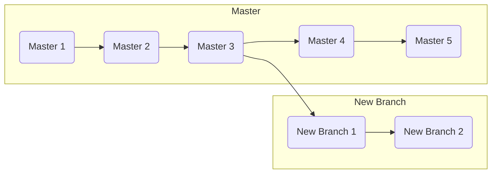

## Branching

## Going back in time
- `git checkout file_name` &rarr; discard all the changes made to the provided file and revert the file back to the latest snapshot of the file (*either committed or staged*)
	-  `git checkout -p file_name` &rarr; git will ask, change by change, if it should revert them.
- `git reset HEAD file_name` &rarr; remove the file from the staging area
- `git commit --amend` &rarr; **change the latest commit** adding the changes found in the staging area (so this _does not_ create a new commit). One can also change the commit message.
	- **NOTE:** do not used on public/shared repositories!! Because this command literally delate the latest commit and rewrite it so, pushing it to a remote location with the original one can cause serious problem and should be avoided. Use only on local commits and then push to remote.

### Rollbacks
- `git revert HEAD` &rarr; _create a new commit with exactly the opposite changes between HEAD and its previous commit._ This will technically revert the state of the project back to the second to last commit, but it maintains intact the history so that bugs can be tracked and corrected. Git will automatically generate a commit message but it is best practice to explain why we are reverting the commit.
	- `git revert commit_ID` &rarr; revert all changes made (only) in the provided commit.

---
## Branching and Merging

- `git branch` &rarr; list all the branches defined in the current repository.
- `git branch branch-name` &rarr; create a new branch called `branch-name`.
	- `git branch -d branch-name` &rarr; delete the provided branch.
- `git checkout branch-name` &rarr; switch to the provided branch.
	- `git checkout -b branch-name` &rarr; create a new branch and automatically switch to it.

{}
The _master_ branch is commonly used to represent the known good state of a project. **When a feature is in development, a new branch should be created.** When the new feature is ready, one can merge the current branch in the master to make it official available.
{}

- `git merge branch-name` &rarr; merge `branch-name` into the active branch.

Git uses two different algorithm to perform a merge: _fast-forward_ and _three-way merge._

### Solving Merge Conflicts

When conflicts are presents, merge is not automatically completed by git. It instead update the file in each location in which conflicts where found. One should then open the file on which the conflicts where found and correct them, _deleting all the lines that are not useful anymore._
Finally, one should add the file to the staging area and commit to complete the merge.

- `git merge --abort` &rarr; stop the merging process. To be used if the merging is going to be too much complicated.

---
## Rewriting History

`git commit —amend` &rarr; replace the last commit with the staged changes and last commit combined
  -   Use with nothing staged to edit the last commit’s message

`git rebase <base>` …