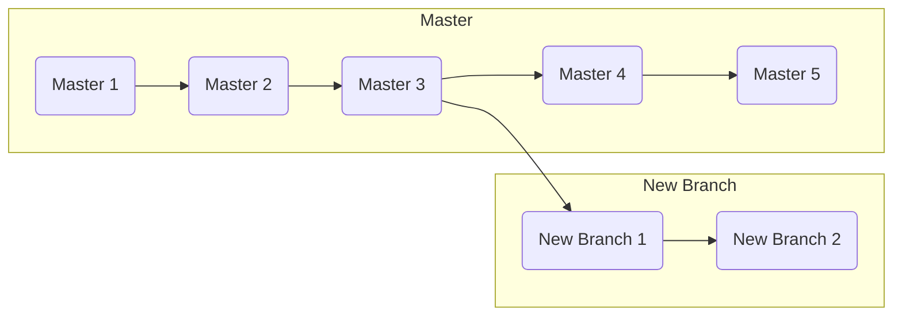

## Branching

## Branching

`git branch` &rarr; **list** all the branches in the repo

`git branch <name>` &rarr; **create** a new branch

`git checkout <branch>` &rarr; **switch** to an existing branch

- `git checkout -b <branch>` &rarr; _create and switch_ to a new branch

`git merge <branch>` &rarr; **merge** the provided branch into the _current branch_

`git branch -d <branch>` &rarr; **delete** the selected branch

---
## Rewriting History

`git commit —amend` &rarr; replace the last commit with the staged changes and last commit combined
  -   Use with nothing staged to edit the last commit’s message

`git rebase <base>` …